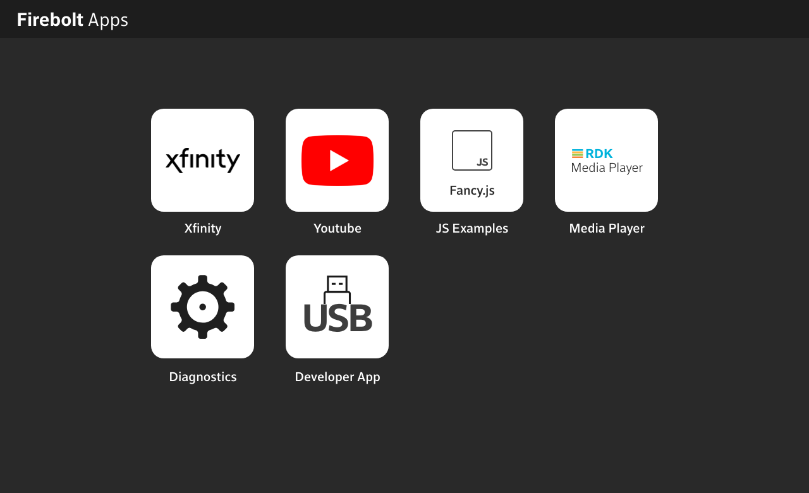

# Firebolt App manager GUI
Kranthi Avula
Date: 04-11-2019

Table of Contents
| 1. Introduction |
| 2. Screenshot of Firebolt App view GUI
| 3. Configuration file |
| 4. App Display |
| 5. Navigation through apps |
| 6. Launch Apps |

#### 1. Introduction:
The document describes the app menu display, navigation details about and the use cases of new Firebolt App manager GUI.

#### 2. Screenshot of Firebolt App view GUI ####

#### 3. Configuration file ####
Firebolt App manager reads and displays the list of available apps from the configuration file, &quot;appmanagerregistry.conf&quot; file. The configuration file provides the display name, URL, icon image, application type (spark, web, native) and version of the app.

#### 4. App Display ####
App manager GUI displays four apps on each row. When more apps are added, a new row is added. The GUI displays an icon and display name for each app. The display size of the app menu and the app icons adapts to the display resolution of any screen. When the &quot;appmanagerregistry.conf&quot; file is updated, the displayed apps icons and display names are updated or new apps are added if a new app is added in the configuration file.

#### 5. Navigation through Apps ###
GUI provides scroll functionality to navigate through all the available Apps. By default, the focus is set on the first app. Users can navigate through the apps using the keys UP, DOWN, LEFT and RIGHT on the keyboard. Mouse functionality is available on the GUI for the user to navigate through the app using mouse.

#### 6. Launch Apps
To launch an App, navigate to the App using either keyboard or mouse to set the focus on the App. Press &quot;ENTER&quot; on the keyboard or click on the mouse to launch the app.

Press &quot;CTRL + m&quot; to go back to the main menu display and stop the running app.
